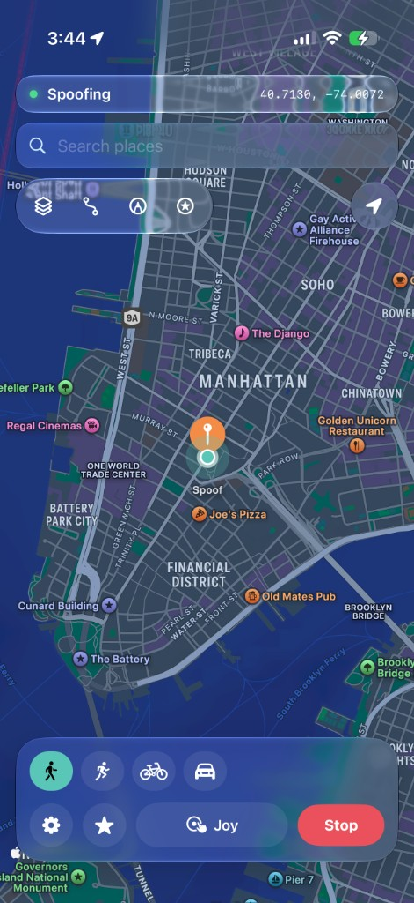
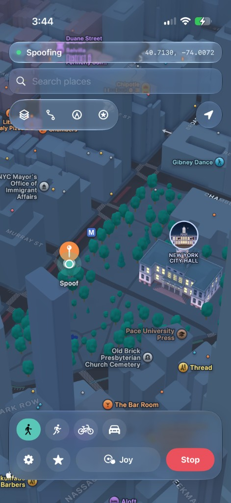
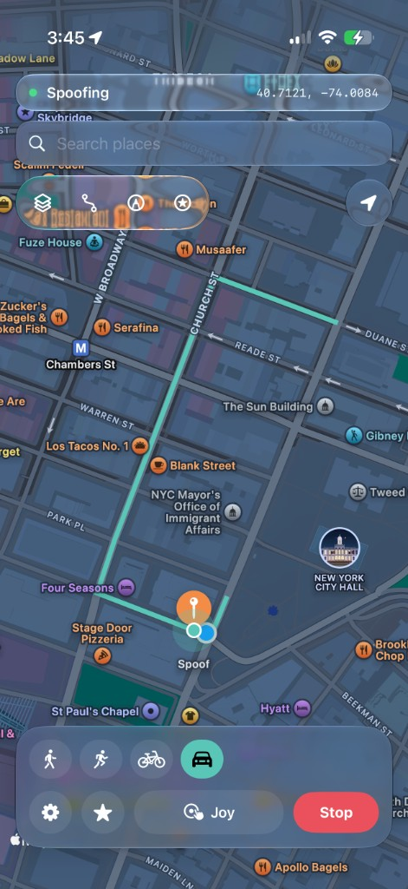

# Locus

免费开源的 iPhone 定位传送工具。点地图、搜地点，或沿路线移动——Locus 通过苹果的**开发者定位服务**把坐标注入 `locationd`，地图和其他 App 会读到伪造的 GPS（不是仅靠 Wi‑Fi 定位、一到室外就被真实 GPS 覆盖那种）。

本仓库为 [Locus](https://github.com/ChrisMack32/Locus) 的**简体中文版**（`1.0.2-zh`），并针对中国大陆地图坐标偏移、LocalDevVPN 状态检测等做了适配。

<p align="center">
  
  
  
  
</p>

## 功能

- 一键传送（地图图钉或地点搜索）
- 实时摇杆——步行 / 跑步 / 骑行 / 驾车，带轻微速度变化
- 沿真实道路与人行道步行/驾车路线（MapKit）
- 手绘路径，或导入 / 导出 GPX
- 后台保活 + 实时状态栏 + 断连提醒
- 收藏与最近记录
- 首次启动引导
- 完全本机运行——无分析、无上传

## 安装

完整步骤见 [SETUP.md](SETUP.md)。可从 [Releases](https://github.com/1115965515/locus-zh/releases) 下载预编译 IPA，或按下方说明自行编译。

Bundle ID：`com.chrismack.locus`

### LiveContainer

LiveContainer 里文件选择器经常不可用，可任选其一：

1. 长按 **Locus** → **设置** → 开启 **Fix File Picker**，再试导入。
2. 把配对文件**分享到 LiveContainer → Locus**。
3. 复制 RPPairing plist 全文 → 在 Locus 使用 **从剪贴板粘贴 RPPairing**（首次引导或设置中）。

## 原理

Locus 使用 MIT 许可的 [idevice](https://github.com/jkcoxson/idevice) FFI，经本机开发者隧道连接苹果 DVT 定位模拟（与 Xcode 同类机制）。

**iOS 27：** 设置 → **在本机配对**，会广播 `_remotepairing-pairable-host._tcp`。在 设置 › 隐私与安全性 › 开发者模式 › 与主机配对 中确认 6 位验证码——无需电脑。

**iOS 18–26：** 用 [idevice_pair](https://github.com/jkcoxson/idevice_pair/releases) 生成并导入一次 **RPPairing** 文件。

另需安装 **[LocalDevVPN](https://apps.apple.com/us/app/localdevvpn/id6755608044)**（本机环回隧道；当前常见默认本机 `10.7.1.1`、对端 `10.7.0.1`），再重签安装 Locus。

建议先在 Wi‑Fi 下启动传送；之后蜂窝网络上会话通常也可继续。

### 《Pokémon GO》及类似游戏

Locus 伪造定位的方式与 Xcode 开发者工具相同：告诉系统「你在这里」，其他 App 从系统读取。信任系统 GPS 的 App（如 Apple 地图）会跟着重定位。

**《Pokémon GO》不同。** 它有自己的位置校验，经常拒绝开发者 / 模拟 GPS（例如 “Failed to detect location”）。用本方式出现这种情况是预期行为，不是 Locus 的 bug，本应用也无法提供受支持的修复。

**iPogo**（以及 SpooferPro 等改版客户端）做法不同：它们是**改过的 Pokémon GO 客户端**，不是系统级定位伪造。功能在改版游戏内部，而不是把坐标喂给整个 iOS。Locus 从不修改或替换 Pokémon GO，只改变系统上报的位置。因此那些工具可能「在 Pokémon GO 里能用」，而 Locus 能正确驱动地图，却仍会被 Pokémon GO 的校验挡住。

Locus 面向系统级传送，不是 Pokémon GO 客户端，也不是反作弊绕过工具。

## 编译

从源码编译需要苹果开发者账号（免费或付费）用于签名。发布的 IPA **不需要**——直接重签安装即可。

1. 如需安装 [XcodeGen](https://github.com/yonaskolb/XcodeGen)：`brew install xcodegen`
2. 在 `project.yml` 中填写 **Team ID**（`DEVELOPMENT_TEAM`），*或* 生成工程后在 Xcode → Signing & Capabilities 中选择团队。
3. 生成并打开：

```bash
xcodegen generate
open Locus.xcodeproj
```

或用命令行编译（将 Team ID 换成你在 [developer.apple.com/account](https://developer.apple.com/account) → Membership 中的 ID）：

```bash
xcodegen generate
xcodebuild -project Locus.xcodeproj -scheme Locus -configuration Release \
  -destination 'generic/platform=iOS' DEVELOPMENT_TEAM=YOUR_TEAM_ID build
```

未签名 IPA 也可由本仓库 GitHub Actions 自动构建，见 [BUILD-ZH.md](BUILD-ZH.md)。

## 许可

MIT。`Vendor/idevice` 中为 idevice FFI（MIT）。Locus 为独立开源项目，与 Mirage / Wapixel 无关。
